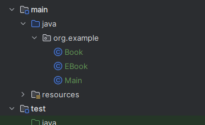
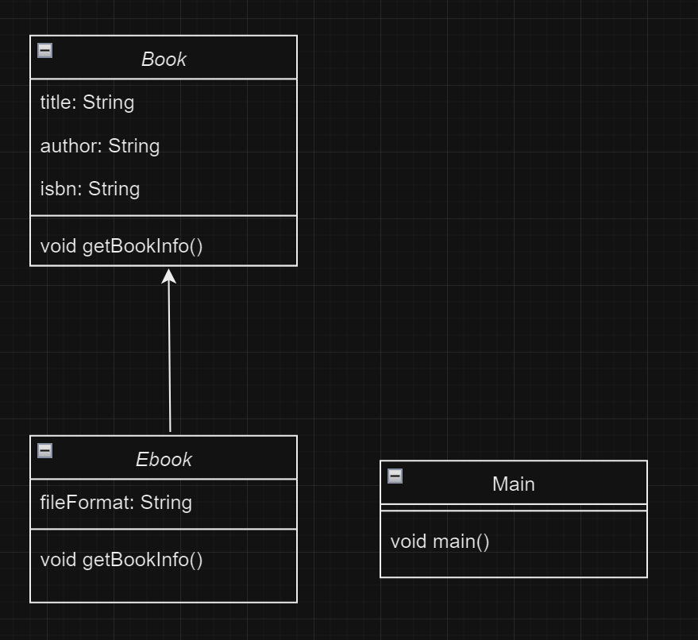

# 도서관 시스템 프로젝트

## 실행방법

Main 클래스 안의 main메서드를 실행하면 됩니다.

## 요구사항

당신은 도서관 시스템을 위한 Book 클래스를 만들고 있습니다.
이 클래스는 모든 책에 공통적인 속성인 제목(title), 저자(author), 그리고 ISBN(isbn)을 인스턴스 변수로 가져야 합니다.

또한, 당신은 `Book 클래스`를 상속받는 `Ebook 서브클래스`도 만들어야 하는데, 이 클래스는 파일 형식(fileFormat)을 추가적인 인스턴스 변수로 가져야 합니다.

다음 요구 사항에 따라 `Book 클래스`와 `Ebook 서브클래스`를 작성하세요.

### Book 클래스

####  인스턴스 변수
- title: 책의 제목을 나타내는 String 타입.
- author: 책의 저자를 나타내는 String 타입.
- isbn: 책의 국제 표준 도서 번호를 나타내는 String 타입.

#### 생성자
- 모든 인스턴스 변수를 초기화하는 생성자.

#### 메소드
- getBookInfo(): 책의 상세 정보를 출력합니다. (예: "Title: The Great Gatsby, Author: F. Scott Fitzgerald, ISBN: 1234567890")

### Ebook 서브클래스

#### 인스턴스 변수
- Ebook 클래스는 Book 클래스를 상속받고, 다음 인스턴스 변수를 추가로 가져야 합니다:
- fileFormat: 전자책 파일 형식을 나타내는 String 타입 (예: "PDF", "ePub", "MOBI").

#### 생성자
- Book 클래스의 모든 인스턴스 변수와 fileFormat을 초기화하는 생성자.

#### 메소드
- Ebook 클래스는 다음 메소드를 가져야 합니다:
- getBookInfo(): 오버라이딩하여 전자책의 상세 정보를 출력합니다. (예: "Title: The Great Gatsby, Author: F. Scott Fitzgerald, ISBN: 1234567890, Format: PDF")

### Main 클래스
- 다음 정보를 사용하여 Ebook 인스턴스를 생성
- 제목 "The Great Gatsby", 저자 "F. Scott Fitzgerald", ISBN "1234567890", 파일 형식 "PDF" 이 출력 되어야함.
---

#### **힌트**
- 상속을 사용할 때는 extends 키워드를 사용합니다.
- 서브클래스에서 메소드를 오버라이딩할 때는 @Override 어노테이션을 사용하는 것이 좋습니다.
- 생성자에서는 super()를 사용하여 부모 클래스의 생성자를 호출할 수 있습니다.
